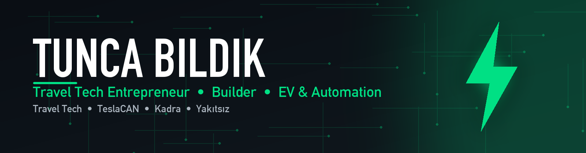

  

  

  
I'm a travel-tech entrepreneur who writes the software behind the business — booking engines, supplier panels, pricing automation and WhatsApp bots. On the side I hack on electric vehicles: an open-source <strong>Tesla CAN-bus mod</strong> for ESP32, a BLE dashboard app for Tesla, and a Turkish EV channel that answers one question with real numbers: <em>should I go electric?</em>

  
🇹🇷 Seyahat teknolojisi alanında girişimciyim; işi çalıştıran yazılımı kendim yazıyorum: rezervasyon motoru, tedarikçi paneli, fiyat otomasyonu, WhatsApp botları. Boş zamanlarımda elektrikli araçlarla uğraşıyorum — ESP32 için açık kaynak Tesla CAN modu, Tesla için BLE gösterge uygulaması ve gerçek rakamlarla "elektrikliye geçmeli miyim?" sorusuna cevap veren <a href="https://youtube.com/@yakitsiz">Yakıtsız</a> kanalı.

 

  
  
  

 

  <h2>Featured Projects</h2>

<table align="center">
  <tr>
    <td align="center" width="50%" valign="top">
      <h3>⚡ <a href="https://github.com/tuncasoftbildik/tesla-can-mod">TeslaCAN</a></h3>
      
Open-source Tesla Model 3 / Y CAN-bus mod for the <strong>ESP32-C6</strong> — FSD activation, battery telemetry, preconditioning, built-in LCD, WiFi dashboard and a Flipper Zero companion app.

      

        
        
        
      

      <code>pio run -t upload</code>
    </td>
    <td align="center" width="50%" valign="top">
      <h3>📱 <a href="https://github.com/tuncasoftbildik/kadra-site">Kadra</a></h3>
      
iOS dashboard for Tesla over <strong>Bluetooth LE</strong> — live speed, battery, range and trip data without the cloud. SwiftUI, StoreKit, on-device only.

      

        
        
        
      

      <code>Coming to the App Store</code>
    </td>
  </tr>
</table>

 

  <h2>Languages & Tools</h2>
  

